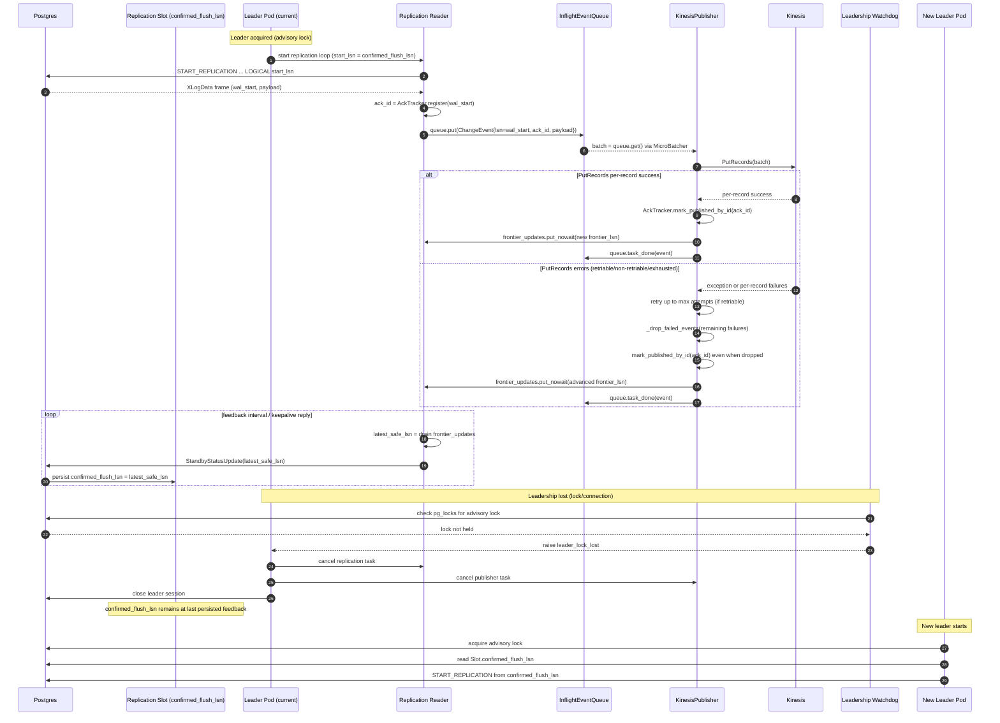

# CDC Logical Replication: Ack, Kinesis Publishing, and Leadership Semantics (Current Behavior)

This document captures the current behavior of the codebase as discussed in this session, focusing on:

- `src/cdc_logical_replication/ack.py`
- `src/cdc_logical_replication/kinesis.py`
- The surrounding leadership and replication pipeline that determines failover behavior

It describes what the system does today (not what it should do).

## Session Questions (As Asked)

The session started with a request to explain the current expectation when any of the following happens:

- Retriable error
- Non-retriable error
- Leader pod connection lost and new leader is established

We then focused primarily on leader failover semantics, specifically:

- Events published to Kinesis but not yet reflected in `confirmed_flush_lsn` can be replayed by the new leader (duplicates possible).
- Events that were "dropped" by the publisher can still advance the frontier/slot, so they will not be replayed (data loss is accepted by current design).

Finally, we confirmed explicitly: in the current implementation, duplicates and data loss are both possible.

## Definitions

- LSN: Postgres WAL position. This pipeline uses the logical replication message's `wal_start` as the LSN for ordering and acking (`src/cdc_logical_replication/replication.py:160`).
- `ack_id`: an in-process monotonic ID assigned per received replication message by `AckTracker.register(lsn)` (`src/cdc_logical_replication/ack.py:41`).
- Published (in-process): the publisher calls `AckTracker.mark_published_by_id(ack_id)` to indicate the event can advance the contiguous frontier (`src/cdc_logical_replication/ack.py:81`).
- Contiguous frontier (`AckTracker.frontier_lsn`): the highest LSN for which *all earlier pending events* have been marked published; this is what is considered safe to flush back to Postgres (`src/cdc_logical_replication/ack.py:94`).
- `frontier_updates`: an in-memory `asyncio.Queue[int]` used to pass advanced frontier LSN values from the publisher task to the replication reader task (`src/cdc_logical_replication/app.py:97`).
- Replication slot checkpoint:
  - `confirmed_flush_lsn` (preferred) or `restart_lsn` (fallback) is read from `pg_replication_slots`.
  - This value is used as the initial replication start point when a leader starts (via `get_replication_slot_confirmed_lsn`) (`src/cdc_logical_replication/slot.py:35`).
- Leadership:
  - Leadership is acquired via a Postgres advisory lock.
  - Loss is detected by polling `pg_locks` and raising `leader_lock_lost` (`src/cdc_logical_replication/leader.py:66`).

## Components (Current Pipeline)

- Replication reader: reads Postgres logical replication frames, registers LSNs into `AckTracker`, and enqueues `ChangeEvent` into `InflightEventQueue` (`src/cdc_logical_replication/replication.py:59`).
- Inflight queue: bounded by both count and total bytes; `queue.task_done(event)` releases byte capacity (`src/cdc_logical_replication/queue.py:6`).
- Kinesis publisher: micro-batches from the queue and calls `PutRecords`, then marks events as published (or dropped) and emits frontier updates (`src/cdc_logical_replication/kinesis.py:54`).
- Replication feedback: drains `frontier_updates` and sends standby status updates to Postgres, which advances the replication slot checkpoint (`src/cdc_logical_replication/replication.py:133`).
- Leadership watchdog: periodically checks whether the leader session still holds the advisory lock and raises when it does not (`src/cdc_logical_replication/leader.py:66`).

## Kinesis Error Semantics

### Retriable Errors (Expectation)

Any error that is not classified as non-retriable is treated as retriable. The publisher retries with exponential backoff and jitter until `retry_max_attempts` is reached (`src/cdc_logical_replication/kinesis.py:100`, `src/cdc_logical_replication/kinesis.py:279`).

- Stream-level exception (the `put_records` call raises):
  - Retries the whole pending set.
  - If attempts are exhausted, drops the entire pending set (`src/cdc_logical_replication/kinesis.py:140`).
- Per-record failures returned by `PutRecords`:
  - Acks successes immediately.
  - Retries only the subset of failed-retriable events.
  - If attempts are exhausted, drops the remaining failed-retriable subset (`src/cdc_logical_replication/kinesis.py:169`, `src/cdc_logical_replication/kinesis.py:205`).

### Non-Retriable Errors (Expectation)

Non-retriable classification is based on a combination of:

- Error codes and prefixes (`AccessDenied*`, `ResourceNotFound*`, validation-related codes, etc.) (`src/cdc_logical_replication/kinesis.py:16`, `src/cdc_logical_replication/kinesis.py:299`)
- Error message markers (e.g., "validation", "resource not found", oversize markers like "1 mb") (`src/cdc_logical_replication/kinesis.py:25`, `src/cdc_logical_replication/kinesis.py:307`)

Behavior:

- Non-retriable stream-level exception:
  - Fail-fast (no retry), drop the whole pending set (`src/cdc_logical_replication/kinesis.py:122`).
- Non-retriable per-record error:
  - Drop only those failed-non-retriable records (successes still progress) (`src/cdc_logical_replication/kinesis.py:188`).

### What "Drop" Means Today

When the publisher "drops" events (either for non-retriable errors or after retry exhaustion), it still:

1. Marks the event as published in `AckTracker` (by `ack_id`).
2. Emits frontier updates if that advances the contiguous frontier.
3. Calls `queue.task_done(event)` to release inflight capacity.

See `_drop_failed_events` (`src/cdc_logical_replication/kinesis.py:236`).

Important note: there is an explicit TODO acknowledging this risk and suggesting a future DLQ/quarantine stream "before acking" (`src/cdc_logical_replication/kinesis.py:256`).

## Leader Failover Semantics (Current Implementation)

### Step-by-Step: Normal Operation

1. The service waits to acquire leadership (Postgres advisory lock) (`src/cdc_logical_replication/app.py:43`).
2. Once leadership is acquired, it reads the replication slot checkpoint LSN (`confirmed_flush_lsn` preferred, else `restart_lsn`) and creates `AckTracker(initial_lsn=initial_frontier_lsn)` (`src/cdc_logical_replication/app.py:59`, `src/cdc_logical_replication/app.py:96`).
3. The replication reader starts from `start_lsn = max(frontier_lsn, last_registered_lsn)` (for a fresh leader cycle, effectively the slot checkpoint) (`src/cdc_logical_replication/replication.py:66`, `src/cdc_logical_replication/replication.py:114`).
4. Each incoming logical replication message:
   - registers `wal_start` to obtain an `ack_id`
   - enqueues `ChangeEvent(lsn=wal_start, ack_id=ack_id, ...)` (`src/cdc_logical_replication/replication.py:160`, `src/cdc_logical_replication/replication.py:173`)
5. The Kinesis publisher `PutRecords` the events and, on success:
   - `AckTracker.mark_published_by_id(ack_id)`
   - `frontier_updates.put_nowait(new_frontier_lsn)` when the contiguous frontier advances
   - `queue.task_done(event)` (`src/cdc_logical_replication/kinesis.py:183`)
6. The replication loop periodically drains `frontier_updates` and sends `StandbyStatusUpdate(latest_safe_lsn)` to Postgres, which advances the slot's `confirmed_flush_lsn` (`src/cdc_logical_replication/replication.py:133`, `src/cdc_logical_replication/replication.py:144`).

### Step-by-Step: Leadership Loss and New Leader Establishment

1. The leadership watchdog periodically checks whether the leader session still holds the advisory lock (`src/cdc_logical_replication/leader.py:66`).
2. If the lock is lost, the watchdog raises `RuntimeError("leader_lock_lost")` (`src/cdc_logical_replication/leader.py:75`).
3. The leader pipeline exits on first exception and cancels all leader tasks (replication reader, publisher, watchdog) (`src/cdc_logical_replication/app.py:140`, `src/cdc_logical_replication/app.py:149`).
4. The leader session connection is closed and leadership is released (`src/cdc_logical_replication/app.py:79`, `src/cdc_logical_replication/leader.py:32`).
5. The outer loop sleeps briefly and then attempts to acquire leadership again (`src/cdc_logical_replication/app.py:83`).
6. A new leader (possibly a different pod) repeats startup:
   - reads the slot checkpoint `confirmed_flush_lsn` / `restart_lsn` (`src/cdc_logical_replication/slot.py:35`)
   - starts replication from that position (`src/cdc_logical_replication/replication.py:89`)

## Mermaid: Current Leader Failover and Checkpointing Flow

## Why Duplicates Can Happen (Published to Kinesis, Not Yet in confirmed_flush_lsn)

Duplicates are possible because "published to Kinesis" and "replication slot checkpoint advanced" are decoupled steps performed by different tasks:

1. The publisher marks events as published (and emits a frontier update) immediately after Kinesis success (`src/cdc_logical_replication/kinesis.py:183`).
2. The replication loop advances the replication slot checkpoint only when it later drains `frontier_updates` and sends a `StandbyStatusUpdate` to Postgres (`src/cdc_logical_replication/replication.py:133`).
3. If leadership is lost after step (1) but before step (2) persists the new LSN as `confirmed_flush_lsn`, the slot checkpoint will lag behind what was actually published to Kinesis.
4. The new leader starts reading from the older `confirmed_flush_lsn` (`src/cdc_logical_replication/slot.py:35`), re-reads those WAL messages, and re-publishes them to Kinesis.

This creates an explicit "duplicate window" during failover.

## Why Data Loss Can Happen (Dropped Events Still Advance Frontier/Slot)

Data loss is possible because the current "drop" implementation still acks dropped records and allows the frontier to advance:

1. A non-retriable error or retry exhaustion triggers `_drop_failed_events(...)` (`src/cdc_logical_replication/kinesis.py:236`).
2. `_drop_failed_events` calls `AckTracker.mark_published_by_id(ack_id)` for each dropped event, which can advance the contiguous frontier (`src/cdc_logical_replication/kinesis.py:256`, `src/cdc_logical_replication/ack.py:94`).
3. The replication loop drains those frontier updates and sends `StandbyStatusUpdate(frontier_lsn)` to Postgres (`src/cdc_logical_replication/replication.py:133`).
4. Postgres advances `confirmed_flush_lsn` past events that were never delivered to Kinesis (they were dropped).
5. A new leader starts replication from that advanced `confirmed_flush_lsn` (`src/cdc_logical_replication/slot.py:35`), so the dropped events are not replayed.

This is why, in the current design, dropped records imply potential data loss.

## Current Guarantees / Outcomes (As Implemented)

- Duplicates are possible across leader changes (publish and checkpoint are decoupled).
- Data loss is possible when the publisher drops events (drop still acks and advances the slot).

 ## Why data loss can happen (dropped events advance the slot, so they will not be replayed)

- On non-retriable errors and on retry exhaustion, the publisher calls _drop_failed_events(...) (src/cdc_logical_replication/kinesis.py:236).
- _drop_failed_events explicitly acks dropped events anyway by calling _mark_event_published (which calls AckTracker.mark_published_by_id) and emits frontier updates (src/cdc_logical_replication/kinesis.py:256, src/cdc_logical_replication/kinesis.py:263).
- The replication loop treats the frontier as “safe to flush” and sends it to Postgres, which advances confirmed_flush_lsn (src/cdc_logical_replication/replication.py:133).
- Result: the slot checkpoint can move past events that were never delivered to Kinesis, and a new leader will start after them, so they are not replayed. The code even documents this as a TODO for a DLQ before acking (src/cdc_logical_replication/kinesis.py:256).
